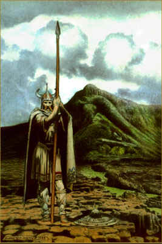
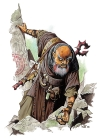
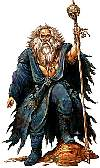
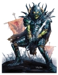
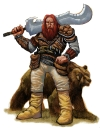
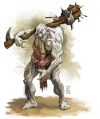
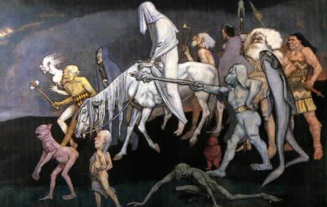
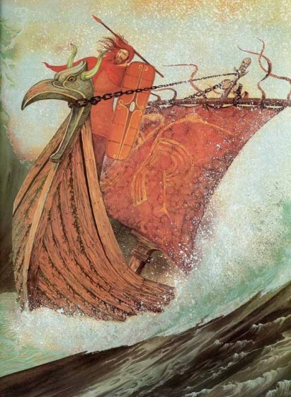
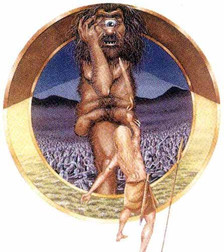

Celtia

**The Battle of Moytura**

**Design Document**

Craig Foucher

CIS 487

Dr. Maxim

Due 12/17/02

# Overview

Celtia is an action/roleplaying game with a mythological storyline. The
player controls Lugh, a mythical warrior god from ancient Ireland. His
task is to rid Ireland of the race of giants, the Fir Bolg, and the race
of monsters, the Fomorians.

The players main task is to navigate Lugh through the game world and
defeat the enemies that he encounters. When Lugh or an enemy is defeated
he disappears. There is minimal violence and gore contained in this
game.

Celtia offers a challenge to the player in that the player must defeat
the main boss enemies in a particular order to win the game. The game is
also easy to play with simple controls. There is one button to attack
enemies, four buttons to move in different directions, and a button to
quit the game.

The setting of Celtia is ancient Ireland. It is the great Battle of
Moytura in which Lugh the warrior god defeats the Fir Bolg and the
Fomorians in order to bring humanity to the world. This is the legend
that is the bases for the Irish creation story. The game starts with
Lugh on the shores of Ireland. He has just arrived from the lands in the
north. No one knows where from exactly though. He is trained in the
occult arts and many trades. He brings with him his mighty spear to
banish the enemy creatures to the underworld.

This game would theoretically appeal to people of all ages. It is easy
to play and contains very minimal gore and violence.

# Game Mechanics

## Overview

Celtia is a 2D third person game in the vein of The Legend of Zelda and
Dungeons and Dragons Warriors of the Eternal Sun. Players of these games
will surely enjoy the look and feel of Celtia.

## Camera Position

In Celtia, the player will control character Lugh. The player can move
Lugh across the screen. When Lugh reaches the edge of the screen the
screen scrolls to another part of the game world and Lugh starts at the
opposite edge of the screen from the previous screen. The camera is
always looking at Lugh and the game world as a partial birds-eye view.

## User Interface Design

The majority of the player\'s screen will be taken up by the game world
view. The is also a black area along the top of the screen that is
approximately one hundred pixels in height. This area displays the
following information:

-   **Lugh\'s Hit Points:** This is the amount of life that Lugh has. If
    it falls to zero or below zero Lugh dies, and the player loses the
    game.

-   **Minions Killed:** This is the count of how many minor enemies that
    the player has killed in the game so far.

-   **Bosses Killed:** This is the count of how many major enemies that
    player has defeated in the game so far. If the player defeats all
    the bosses they win the game.

## Replaying and Saving 

There are no number of \"lives\" in Celtia. Once the player\'s hit
points fall to or below zero, they lose the game. If this happens the
player must restart the game and start from the beginning again. There
is no save option as of yet implemented in Celtia.

## Control Summary

The player will use only a limited number of controls to maneuver Lugh
throughout the game world. These controls are as follows:

-   **Up, Down, Left, Right Arrows:** The player uses these controls to
    move Lugh across the screen.

-   **Attack (Space Bar):** The player uses the space bar to make Lugh
    thrust with his spear. If he hits an enemy while attacking the enemy
    takes damage points off of its hit points.

-   **Exit (Esc Key):** The Escape key is used to quit the game.

## Game Play Details

In Celtia the player must make Lugh attack enemies in order to defeat
them. If Lugh comes into contact with an enemy and is not attacking, he
will take damage points off of his hit points. If Lugh\'s hit points
fall to or below zero he dies and the player loses the game.

The player must find the main boss lairs in a particular order. If the
lair is found out of order the boss for that lair will not be there.
Once all of the bosses have been found and defeated the player wins the
game.

## Cut-Scenes

There are no cut-scenes in Celtia.

## Storytelling

There are no storytelling components in Celtia. The story is only given
in the documentation.

Level Summary

The levels of Celtia are as follows:

-   **Main Game World:** This is the starting point of the game. It is a
    5x6, 30 page world in which the player maneuvers Lugh. The player
    must defeat enemies and find the lairs where the bosses are located.

-   **Boss Lair 1:** This lair is located in the far right area of the
    main game world. This is where the first boss is located, Domnann.

-   **Boss Lair 2:** This is the lair where the second boss, Balor, is
    located. Lugh must defeat Domnann before Balor will appear in this
    lair.

-   **Boss Lair 3:** This is the lair of Eiric, king of the Fir Bolg.
    Lugh must defeat Domnann and Balor before this boss will appear
    here. Once this boss is defeated, the player wins the game.

# Artificial Intelligence

## Enemy AI

All enemies in Celtia follow Lugh\'s position on the screen. They keep
coming toward him until they collide with him. The algorithm for this is
very simple. The x and y positions of the enemy is changed to make them
closer to Lugh\'s x and y positions.

## Player Detection

All of the enemies use the same AI previously mentioned above. The only
difference is that some enemies move faster than others. This provides
somewhat of a challenge to the player.

## Motion

The motion of Lugh and the enemies of Celtia uses simple physics.
Characters are moved in either the x or y directions according to
controls, in the case of Lugh, and Lugh\'s position.

## Path Finding/Collision Detection

Both Lugh and the enemy characters in the game are not able to move over
background objects such as trees, water, mountains, swamp land, a
castle, rocks, etc. If the encounter one of these objects they are
prevented from proceeding in their current direction.

## Special Actions

There are no special actions in Celtia.

## Combat (attack, evasion, damage)

Lugh is the only character in the game that actually attacks with an
attack animation. All of the enemies just move towards Lugh and don\'t
actually make attacking motions. If Lugh collides with an enemy he
either takes damage or gives damage to the enemy. If Lugh is attacking,
he gives damage. Otherwise he takes damage off of his hit points.

Non-player Characters

## Puzzles and Traps

The only puzzle in Celtia is that the player must figure out the order
in which to defeat the main bosses. The player must find each lair in
order and defeat the boss to win the game.

# Game Elements

## Items

Although they were originally planned, due to time constraints items
were not included in Celtia.

## Character bibles 

{width="1.4166666666666667in"
height="2.125in"} **Lugh** - son of Ethne and Cian, known as Lugh of the
Long Arm. He is a skilled warrior, leader, craftsman, and sorcerer. He
is well known for his deeds in battle and his skill in using his sacred
spear. It is said that no battle was ever sustained against the spear.
His skills are now put to the ultimate test.

{width="1.3888888888888888in"
height="1.9444444444444444in"} **Eochaid mac Eirc** - king of the Fir
Bolg. He is a tyrannical king who reigns chaos upon the land. He awaits
the hero Lugh to engage in the battle of destiny.

{width="1.3888888888888888in"
height="2.3333333333333335in"} **Balor** - the evil sorcerer. His origin
is unknown. He is thought to be one of the ancient sages that turned
from the balance of the world and plunged himself into chaos.

{width="1.3888888888888888in"
height="1.7777777777777777in"} **Indech mac De Domnann** - king of the
Formorians. He is a deadly fighter who is known for his terrifying skill
in battle.

{width="1.3888888888888888in"
height="1.7777777777777777in"} **Fir Bolg** - a race of giants that
inhabit Ireland. These are the minions of Eochaid mac Eirc.

{width="1.3888888888888888in"
height="1.6527777777777777in"} **Formorians** - a race of monster-like
creatures that inhabit Ireland. They are chaotic and will attack when
they wish.

# Story Overview

The story is based on an excerpt from the epic \"The Battle of
Moytura.\" This is a mythological story that is considered to be the
creation story of Ireland. It describes how the Irish people came to
Ireland. The story has been slightly modified for the purposes of this
game.

The Tuatha de Dannan were in the northern islands of the world, studying
occult lore and sorcery, druidic arts, witchcraft and magical skills,
until they surpassed the sages of the pagan arts. They studied occult
lore, secret knowledge and diabolic arts in four cities: Falias, Gorias,
Murias, and Findias.

From Falias was brought the Stone of Fal which was located in Tara. It
used to cry out beneath every king that would take Ireland. From Gorias
was brought the Spear of Lugh. No battle was ever sustained against it.
From Findias was brought the Sword of Nuada. No one ever escaped from it
once it was drawn from its deadly sheath, and no one could resist it.
From Murias was brought Dagda\'s cauldron. No one went away from it
unsatisfied.

For many years the battles have raged on for control of these four
magical items. For it is said that if a good man controls these items
then peace and prosperity will come to Ireland. However, if one of evil
gains these items chaos will befall the land.

The Fir Bolg control three of the magical items and the land is
continually chaos and strife. Now it is up to you, Lugh son of Ethne, to
use your sacred spear and retrieve the other three magical items in
order to bring peace to Ireland.

## Background/Plot Summary

The Tuatha de Dannan were in the northern islands of the world, studying
occult lore and sorcery, druidic arts, witchcraft and magical skills,
until they surpassed the sages of the pagan arts. They studied occult
lore, secret knowledge and diabolic arts in four cities: Falias, Gorias,
Murias, and Findias.

From Falias was brought the Stone of Fal which was located in Tara. It
used to cry out beneath every king that would take Ireland. From Gorias
was brought the Spear of Lugh. No battle was ever sustained against it.
From Findias was brought the Sword of Nuada. No one ever escaped from it
once it was drawn from its deadly sheath, and no one could resist it.
From Murias was brought Dagda\'s cauldron. No one went away from it
unsatisfied.

For many years the battles have raged on for control of these four
magical items. For it is said that if a good man controls these items
then peace and prosperity will come to Ireland. However, if one of evil
gains these items chaos will befall the land.

The Fir Bolg control three of the magical items and the land is
continually chaos and strife. Now it is up to you, Lugh son of Ethne, to
use your sacred spear and retrieve the other three magical items in
order to bring peace to Ireland.

## Storyboard

### The Fomorians and the Fir Bolg

The Formorians and the Fir Bolg inhabit Ireland. Chaos overwhelms the
land.

{width="2.125in"
height="1.3472222222222223in"}

### Lugh\'s Arrival

Lugh arrives to bring peace and order to Ireland. He brings with him his
sacred spear.

{width="1.5694444444444444in"
height="2.125in"}

### The Battle for Ireland

Lugh battles the Formorians and the Fir Bolg to bring balance to the
land.

{width="1.4583333333333333in"
height="1.6527777777777777in"}

# Game Progression

## Setting

The game takes place in mythical ancient Ireland. The race of giants,
the Fir Bolg, and the race of monsters, the Fomorians, inhabit the
island. Lugh is the great warrior god of the Tuatha De Dannan and he
must rid Ireland of these creatures.

## Introduction

The player controls the character Lugh. Lugh arrives in Ireland to rid
it of the evil menace of the Fir Bolg and Fomorians. Lugh is a Tuatha De
Dannan a spiritual race of beings that are skilled in the occult arts
and trades.

##  Flowchart

## Level and Scene Details

The levels of Celtia consist of a main world and four sub-worlds or
levels. Each sub-world contains a main boss that Lugh must defeat in
order to gain a magical item and therefore advance to the next
sub-world. Due to constraints on time for this project, these sublevels
may not be fully implemented. It may be the case that these sublevels
are no more than one or two room battle areas. They may be expanded at a
later date.

### Main World

The main world is where the player starts the game. It contains a
forest, swamp, standing stone circle, mountains, and a castle. There are
Fir Bolg and Formorian enemies and special items founds throughout the
main world. There are also access points to sub-worlds in the different
areas. See Figure 2 attached to this document.

### Boss Lair 1

Boss Lair 1 is located in the mountains in the far right area of the
main game world. This is where the player must defeat Domnann, the king
of the Fomorians.

### Boss Lair 2

Boss Lair 2 is located in an ancient tree in the top left corner of the
main game world map. This is where Balor, the evil sorcerer, is located.
Lugh must defeat Domnann before being able to confront this enemy.

### Boss Lair 3

Boss Lair 3 is located in a castle in the top part of the main game
world map. This is where Eiric, the king of the Fir Bolg, is located.
Lugh must defeat Domnann and Balor before being able to confront this
enemy.

# Bibliography

Rouse, Richard III. [Game Design Theory and Practice.]{.ul} Wordware
Publishing Inc., Plano, Texas, 2001.

LaMothe, Andre. [Tricks of the Windows Game Programming Gurus.]{.ul}
Sams Publishing, Indianapolis, Indiana, 2002.
